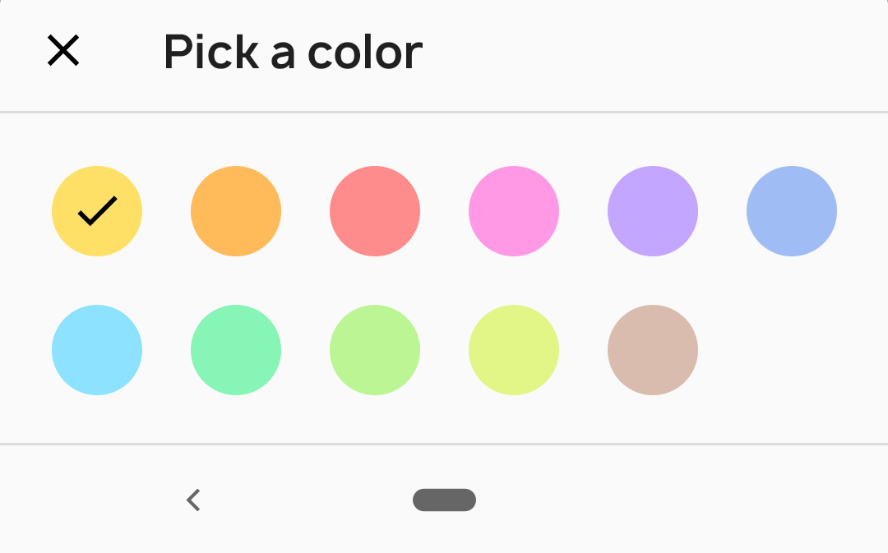
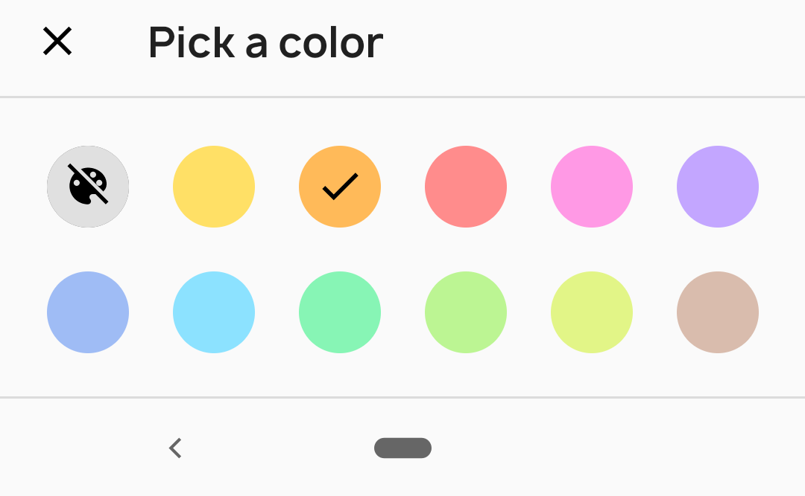

# ColorSheet
A color picker bottom sheet

[  ](https://bintray.com/sasikanthmiriyampalli/maven/color-sheet/1.0.0/link)

```
implementation "dev.sasikanth:colorsheet:1.0.0"
```

## Usage
**Default color sheet, it will show grid of colors**


<br>

```
ColorSheet().colorPicker(
    colors = colors,
    listener = { color ->
        // Handle color
    })
    .show(supportFragmentManager)
```

---

**Color sheet with "no color" option**


<br>

```
ColorSheet().colorPicker(
    colors = colors,
    noColorOption = true,
    listener = { color ->
        // Handle color
    })
    .show(supportFragmentManager)
```
With this you will get a no color option at start, when user selects this it will return **ColorSheet.NO_COLOR**.

- - - -

To mark the color as selected in color sheet, specify selectedColor in colorPicker

```
ColorSheet().colorPicker(
    colors = colors,
    selectedColor = color,
    listener = { color ->
        // Handle color
    })
    .show(supportFragmentManager)
```

- - - -
### Misc
**Corner radius**
Default corner radius is 4dp. You can set your own corner radius like this
```
ColorSheet().cornerRadius(8)
```

**Color to Hex string**
```
ColorSheetUtils.colorToHex(color)
```

**Sheet title textAppearance**
```
    <style name="AppTheme" parent="Theme.MaterialComponents">
        <item name="colorSheetTitleFont">@font/font</item>
        <item name="colorSheetTitleLineHeightHint">@dimen/line_height_hint</item> // in sp
        <item name="colorSheetTitleLetterSpacing">0</item>
    </style>
```

### License

```
Copyright 2019 Sasikanth Miriyampalli

Licensed under the Apache License, Version 2.0 (the "License");
you may not use this file except in compliance with the License.
You may obtain a copy of the License at

   http://www.apache.org/licenses/LICENSE-2.0

Unless required by applicable law or agreed to in writing, software
distributed under the License is distributed on an "AS IS" BASIS,
WITHOUT WARRANTIES OR CONDITIONS OF ANY KIND, either express or implied.
See the License for the specific language governing permissions and
limitations under the License.
```
